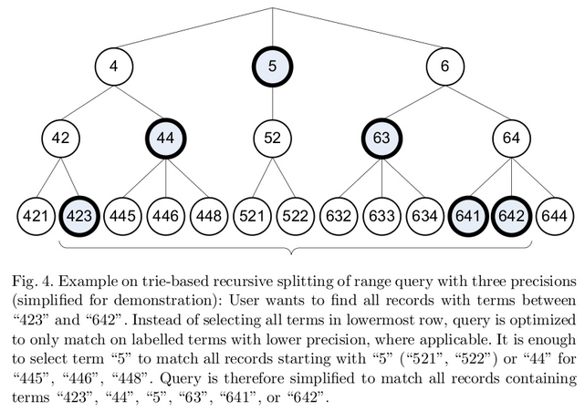

前面了解到Lucene对Int类型和Float类型处理机制如下:
1. 对于是Float类型, 将Float转成Int, 然后按照Int类型处理.
2. 对于Int类型, 将其转换成Sortable Int, 然后按照7-bit为一个单位转换成长度为6的字节数组.

本节的目标是了解Lucene对数值类型进行分词的过程. 了解了这一过程, 就很容易理解Lucene数值类型的查询原理, 比如NumericRangeQuery.

我们知道, Lucene对英文分词, 基本上就是按空格进行切分, 比如"show me the code", 分词后的形式就是["show", "me", "the", "code"]
数值类型分词与文本分词不同, 比如整数1, 转换成字节数组后,其值为`[60 8 0 0 0 1]`(注意数组中是16进制, 而非10进制)
```
// Lucene-5.2.0
public static void main(String[] args) throws IOException {
	BytesRefBuilder bytes = new BytesRefBuilder();
	NumericUtils.intToPrefixCodedBytes(1, 0, bytes);
	System.out.println(bytes.toBytesRef()); // [60 8 0 0 0 1]
}
```

对于`[60 8 0 0 0 1]`, 如果按照默认的precisionStep=8, 则分词的结果为:
```
[60 8 0 0 0 1]
[68 4 0 0 0]
[70 2 0 0]
[78 1 0]
```
分词的代码为:
```
public static void main(String[] args) throws IOException {
	final NumericTokenStream stream= new NumericTokenStream(8).setIntValue(1);
    final TermToBytesRefAttribute bytesAtt = stream.getAttribute(TermToBytesRefAttribute.class);
    final TypeAttribute typeAtt = stream.getAttribute(TypeAttribute.class);
    final NumericTokenStream.NumericTermAttribute numericAtt = stream.getAttribute(NumericTokenStream.NumericTermAttribute.class);
    final BytesRef bytes = bytesAtt.getBytesRef();
    stream.reset();
    for (int shift=0; shift<32; shift+=NumericUtils.PRECISION_STEP_DEFAULT_32) {
      stream.incrementToken();
      bytesAtt.fillBytesRef();
      System.out.println(bytesAtt.getBytesRef());
    }
    stream.end();
    stream.close();
	
}
```

数值分词其实就是拆分前缀. 上面的结果不像通常理解的前缀关系,这是因为添加了shift信息. 如果同时对多个数进行分词, 排序后对比, 就能体会到前缀的意义了.

前缀的比特数由precisionStep决定, 对于`NumericUtils.intToPrefixCodedBytes()`, 对应着参数shift 
```
  public static void intToPrefixCodedBytes(final int val, final int shift, final BytesRefBuilder bytes) {
    // ensure shift is 0..31
    if ((shift & ~0x1f) != 0) {
      throw new IllegalArgumentException("Illegal shift value, must be 0..31; got shift=" + shift);
    }
    int nChars = (((31-shift)*37)>>8) + 1;    // i/7 is the same as (i*37)>>8 for i in 0..63
    bytes.setLength(nChars+1);   // one extra for the byte that contains the shift info
    bytes.grow(NumericUtils.BUF_SIZE_LONG);  // use the max
    bytes.setByteAt(0, (byte)(SHIFT_START_INT + shift));
    int sortableBits = val ^ 0x80000000;
    sortableBits >>>= shift;
    while (nChars > 0) {
      // Store 7 bits per byte for compatibility
      // with UTF-8 encoding of terms
      bytes.setByteAt(nChars--, (byte)(sortableBits & 0x7f));
      sortableBits >>>= 7;
    }
  }
```
上面的代码, 在`Lucene处理Int类型数据的方法与原理`一文中也贴过. 再看上面的代码, 是否觉得清晰了许多?

前缀具有什么优良的特性呢?  在数据结构上, 前缀属于典型的以空间换时间策略. 即通过存储空间的消耗,换取到极短的查询时间.
如果学习过Trie和线段数, 树状数组这些数据结构, 可能会更容易理解Lucene这里的做法.

我们知道, Lucene存储的是倒排索引, 即`term ---> [docid, docid, ... ]` . 假设有如下的需求: 查询价格在[421, 448]的商品.
假如商品的价格信息如下: A=423, B=445
对于前缀索引, 其索引结构是这样的:
```
423---> [A]
425 --> [A]
42  --> [A,B]
4   --> [A,B]
```
在查询的时候, 只需要查询前缀4, 就可以了.

为了对Lucene的前缀更有感觉,  可以对一系列的整数进行分词, 然后查看分词的结果. 代码如下:
```
	public static void tokenAnalyzer(Set<String> list , int val) throws IOException{
		
		final NumericTokenStream stream= new NumericTokenStream(8).setIntValue(val);
	    final TermToBytesRefAttribute bytesAtt = stream.getAttribute(TermToBytesRefAttribute.class);
	    final TypeAttribute typeAtt = stream.getAttribute(TypeAttribute.class);
	    final NumericTokenStream.NumericTermAttribute numericAtt = stream.getAttribute(NumericTokenStream.NumericTermAttribute.class);
	    final BytesRef bytes = bytesAtt.getBytesRef();
	    stream.reset();
	    for (int shift=0; shift<32; shift+=NumericUtils.PRECISION_STEP_DEFAULT_32) {
	      stream.incrementToken();
	      bytesAtt.fillBytesRef();
	      list.add(bytesAtt.getBytesRef().toString());
	      
	    }
	    stream.end();
	    stream.close();
	}
	
	public static void main(String[] args) throws IOException {
		TreeSet<String> list = new TreeSet<String>();
		for(int i=1;i<512;i++){
		    tokenAnalyzer(list, i);
		}
		System.out.println("size of list is "+list.size());
		for(String s: list)System.out.println(s);
	}
```
结果如下:
```
size of list is 515
[60 8 0 0 0 10]
    ...
[60 8 0 0 3 e]
[60 8 0 0 3 f]
[68 4 0 0 0]
[68 4 0 0 1]
[70 2 0 0]
[78 1 0]
```
如果查询区间[1,255]的文档信息, 则只需要查询`[68 4 0 0 0]`就OK了. 如果单纯地使用BooleanQuery,不构建前缀索引, 则需要拼接255个TermQuery.两者之间的查询性能, 可想而之. 

前面说到, 前缀的缺点就是空间消耗. 这一点可以在建立索引时通过precisionStep参数来调整. precisionStep越小, 空间消耗越大, precisionStep越大, 空间消耗越小. 需要注意的是, 在业务中,并不是precisionStep越小, 查询性能越好. 究竟precisionStep设置多大才能达到最佳的平衡点, 需要具体业务, 具体对待.


 


 
