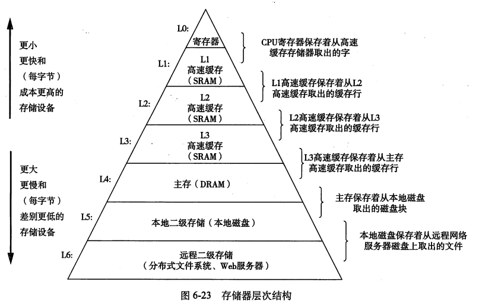
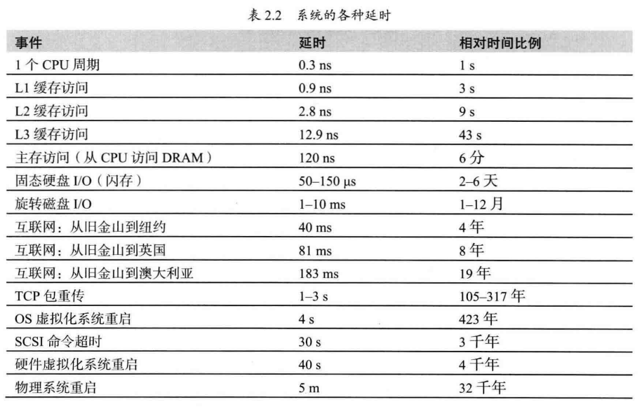
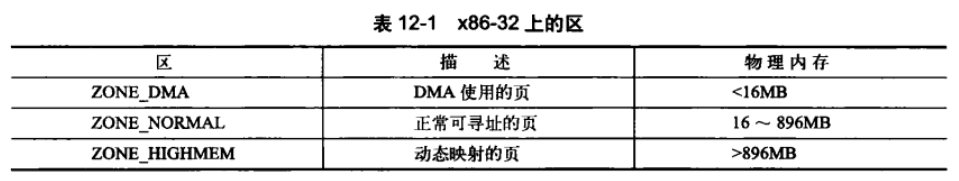
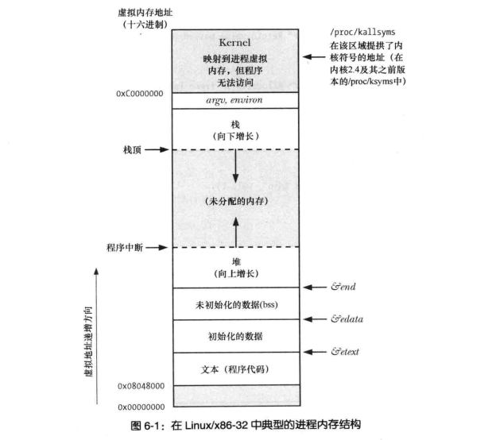
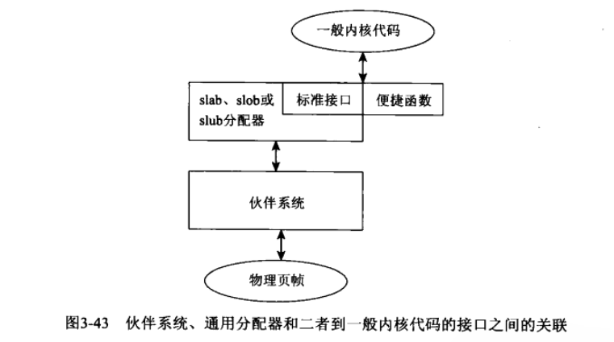

《深入理解计算机系统》一书，内容相当庞杂。本文这里只梳理一下内存相关的知识点。具体地说，是`第6章(存储器层次结构)`和`第9章(虚拟存储器)`的内容。


了解内存，需要先从CPU开始。 

**CPU**

CPU本质上是一个震荡器，再通俗形象一点，CPU像钟摆，秋千一样。 CPU的工作相当简单：取指令，然后执行指令。 这个速度有多快呢？ 通过Linux的bogomips可以窥探一二。以我的i5笔记本为例， 显示每秒可以执行47亿条指令。当然这只是个测算的值，所以称谓(bogos)伪造的mips(百万指令数每秒)
```
cat /proc/cpuinfo 
...
bogomips	: 4789.42
...
```

这样的执行速度，使得CPU每秒读取的速度高达6GB/s。 如果以这个速度下载电影，1秒可以下载好几部高清电影了。
理解CPU的工作原理，个人觉得《编码：隐匿在计算机软硬件背后的语言》是相当不错的科普书籍了。

无论什么样的代码，最终在CPU眼里，执行的都是指令。


**内存**

CPU执行的指令需要有个地方存储，对存储的要求比较高： 读取速度要快，容量要大，成本要比较低。 这就是内存的用武之地了。


从原理上讲，CPU + 内存已经是黄金搭档了，为什么还要扩展成如此复杂的存储体系？如下图:


在《性能之巅：洞悉系统企业与云计算》一书中，对系统各个核心组件的延时有个形象的图标，如下图:


我认为关键因素就在于CPU访问内存的延时。如此高的延时，在计算机程序具备局部性原理的加持下，配置缓存就能大幅提升程序性能。

其他相关的指标对比也可以参考下表。

|         |L1-数据缓存|L2-缓存  |L3-缓存 |内存    |磁盘   |SSD     |
|  ----   |  ----     |  ----   |  ----  | ----   | ----  | ----   |
| 缓存大小|	32KB  |	256KB	|8MB     |十几GB  |几TB   |几百GB  |
| 访问时间|	2ns   |	5ns	|14-18ns |24-93ns |13.0ms |30-300us|
| 吞吐量  |6500MB/s   |3300MB/s |2200MB/s|800MB/s |60MB/s |250MB/s |


所谓局部性原理，可以从时间和空间两个维度来看。 
从时间维度，就是最近访问的数据，很大概率程度上会再次访问。所谓金鱼的记忆只有7秒，太健忘了。唯有不断重复才能保持住记忆。
从空间维度，就是当前访问数据附近的数据，很大概率程度上会再次访问。所谓城门失火，殃及池鱼。


所以，该如何审视内存呢？ 站在不同的视角，得到的结果是不一样的。 从硬盘的角度，内存就是缓存。 从数据库的角度，内存是主存。从数据结构的角度，内存就是一个超大的一维数组。

如果将内存看成超大的一维数组，会很有意思。首先就是管理的问题， 以4G的内存为例，4G=4*1024*1024*1024=4294967296。即42亿字节。

长度单位有厘米，米，千米，光年。各种不同的单位其实是为了解决不同场景下度量的问题。 比如若用光年来测算身高，简直不可理喻。同样内存作为计算机的核心，也面临着丰富的场景。不同的场景需要不同的概念来应对。

区(Zone): 内存常驻进程有两类，用户进程和内核进程。 基于安全性的考虑，就对内存进行了分区。 



页(Page): 内存作为磁盘的缓存，磁盘是块设备，一个块通常是512byte, 若缓存磁盘文件，按块来则方便高效很多。进程使用内存，若按字节管理，粒度就太细了，所以定义了页，1页=4k。 为了应对超大内存，比如128G, 256G这种，又定义了hugepage。

内存的使用，最具创新的点就是虚拟内存。通过虚拟内存，给进程一个承包了整个鱼塘的错觉。简化了链接，加载，共享，存储器分配。以C语言为例，展示进程的内存布局。



存储器分配又是内存使用最具技巧的地方。不仅发展出了buddy, slab分配机制，而且使得各种垃圾回收算法大放异彩。 


在页的基础上，buddy分配器用于分配一个或者多个页， slab用于分配通用的小块内存。

显示分配的内存，基本上都是基于链表记录块的使用情况。
隐式分配的内存，基本上都是基于有向可达图关联分配的块，从而实现垃圾回收。


